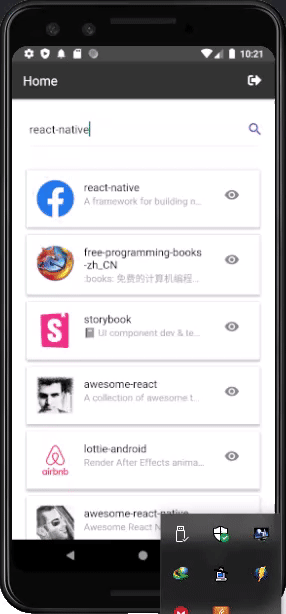
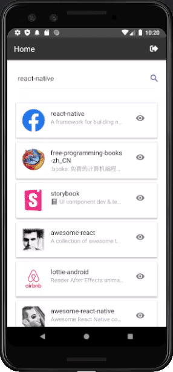

# Github Api React Native
Interview Test AskSteve

Installation instructions :
1. Clone the repository
2. ``npm install``
3. ``react-native run-android``

Features :
1. Login using github account

2. Search github repository

3. Show commits of repo

4. Infinite loading both repository and commit

